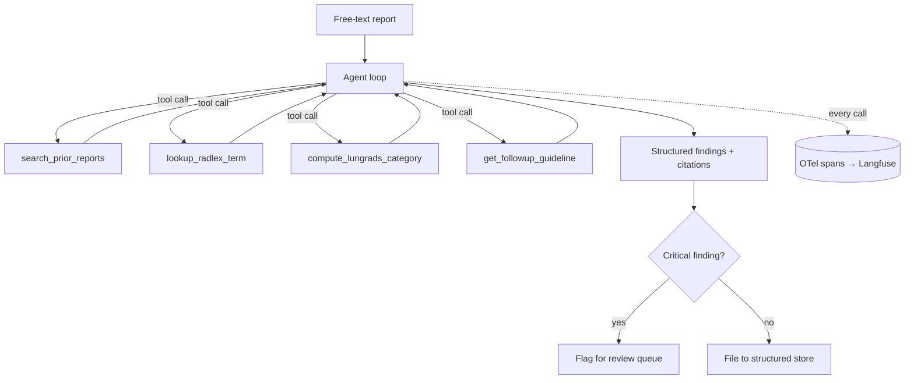

# radreport-agent

> Structured extraction, prior-comparison, and critical-finding triage for radiology reports — clinician-facing decision support, not autonomous diagnosis.

<!-- TODO: replace with a GIF of the trace view or CLI output. This is the first thing anyone sees. -->


[](../../actions)
[](LICENSE)

## What this is

An agent that reads a free-text radiology report, extracts structured findings against a controlled vocabulary (RadLex), compares them against a patient's prior reports, and flags findings that require follow-up under standard guidelines (Fleischner criteria for pulmonary nodules, Lung-RADS for lung cancer screening). Every flagged finding is cited to the specific sentence it came from.

**What it is not:** a diagnostic tool. It surfaces and structures information a radiologist has already written; a human reviews every output before it reaches a chart or a referral.

## Why this is hard

- Report language is unstructured and inconsistent ("no significant interval change" vs. "stable" vs. "unchanged") — normalization has to be robust, not a keyword match.
- "Critical finding" is a guideline lookup (Fleischner size/growth thresholds, Lung-RADS category), not a vibe — it has to be computed by a tool, not asserted by the model.
- Comparing against priors means the agent must *decide what to retrieve*, not have every prior report shoved into context.

## Architecture



## Results

<!-- TODO: fill in after the eval suite exists (see evals/). Numbers, not adjectives. -->

| Metric | v1 (naive tool schema) | v2 (redesigned schema) |
|---|---|---|
| Finding extraction F1 vs. CheXpert labels | — | — |
| Critical-finding recall | — | — |
| Avg. tokens / report | — | — |
| Avg. cost / report | — | — |

See [`evals/README.md`](evals/README.md) for the golden set and methodology, and [`traces/`](traces/) for exported example runs.

## Regulatory positioning

This system performs structuring and triage of existing radiologist-authored text. It does not generate a diagnosis or interpret the underlying image. Outputs are advisory and require sign-off before any downstream action (chart entry, referral). This mirrors the CDS carve-out under the 21st Century Cures Act for software that displays/organizes information and lets a clinician independently review the basis for a recommendation — see [`docs/architecture.md`](docs/architecture.md) for the full reasoning.

## Data

Uses [MIMIC-CXR](https://physionet.org/content/mimic-cxr/) reports (de-identified, requires PhysioNet credentialing) for eval, and [Synthea](https://synthetichealth.github.io/synthea/)-generated synthetic patients for prior-report retrieval demos. **No real PHI is used anywhere in this repo.**

## Stack

Claude Sonnet 5 (extraction) + Haiku 4.5 (grading) · MCP (FastMCP) · Pydantic · Langfuse + OpenTelemetry · Postgres · FastAPI

## Running it

```bash
uv sync
cp .env.example .env  # add ANTHROPIC_API_KEY
uv run python -m radreport_agent.agent --report path/to/report.txt
```

## Project layout

```
src/radreport_agent/
  agent.py             # the agent loop
  mcp_server/          # tools exposed as an MCP server
evals/                 # golden set + eval harness
traces/                # exported example traces (committed evidence, not just claims)
docs/                  # architecture + regulatory notes
```
