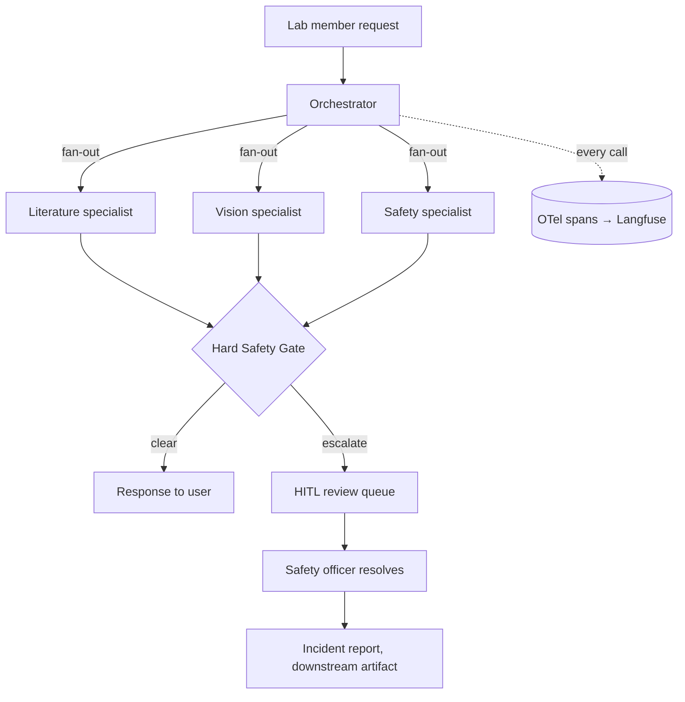

# labmate

> A multi-agent lab assistant — literature, sample-image analysis, and safety — built around one non-negotiable rule: **no specialist ever clears a hazard on its own.**

<!-- TODO: replace with a GIF once M4's review-queue UI exists. -->


[](../../actions)
[](LICENSE)

## What this is

A lab member can ask three kinds of things: "what's the latest research on
X," "what does this sample image show," or "is this safe / what do I do."
An orchestrator routes each to a specialist. But **no specialist response
reaches the user directly** — every draft, from every specialist, passes
through a Hard Safety Gate that can only clear or escalate to a human
safety officer. A literature agent surfacing a novel chemical protocol, or
a vision agent describing a sample image, is subject to the exact same gate
as an explicit safety question. See [`docs/architecture.md`](docs/architecture.md)
for the full reasoning, including the structural gaps in the original
one-safety-agent design and why the gate looks the way it does.

**What it is not:** an autonomous authority on lab safety. It does not
replace a safety officer, an SDS binder, or institutional biosafety review
— its job is routing the right questions to a human fast enough to matter,
and never letting one slip through unanswered-but-unescalated.

## Built as one project, seven milestones

Each milestone lands one concept from modern agentic AI engineering, on the
same codebase, in order — so the git history is itself the portfolio
artifact, not just the final state. Full detail and current status in
[`MILESTONES.md`](MILESTONES.md).

| # | Milestone | Concept |
|---|---|---|
| M0 | Bare loop + hardcoded routing | Harness (seed) |
| M1 | Real tools + tracing | Tool design, Observability |
| M2 | Lab memory + environmental state | Context engineering, Memory |
| M3 | The Hard Safety Gate | Guardrails, Permissions |
| M4 | Eval suite + HITL review queue | Evals, Human-in-the-loop |
| M5 | LangGraph orchestrator | Orchestration |
| M6 | Formalize the harness | Harness (capstone) |

**Current status: M2 complete.** Literature search (PubMed + preprints),
GHS safety-data lookup, biosafety-level lookup, the SOP handbook, and
environmental-state tracking are all live today, no framework and no API
key needed:

```bash
uv sync
PYTHONPATH=src python -c "
from labmate.mcp_server.tools import dispatch_tool
print(dispatch_tool('lookup_sds', {'substance': 'formaldehyde'}))
print(dispatch_tool('search_pubmed', {'query': 'lipid nanoparticle CRISPR delivery', 'max_results': 3}))
print(dispatch_tool('search_sop_handbook', {'query': 'formaldehyde disposal'}))
dispatch_tool('log_environmental_state', {'bench': 'bench-2', 'description': 'active Bunsen burner', 'logged_by': 'alex'})
print(dispatch_tool('get_environmental_state', {'bench': 'bench-2'}))
"
```

Every call above writes a traced span to `var/spans.jsonl` and, where
relevant, a row to `var/labmate_memory.db` — no Langfuse account or
Postgres instance required to see tracing and memory working (see
`src/labmate/observability.py` and `src/labmate/memory/store.py`).

## Architecture



Full M5 graph blueprint (LangGraph nodes, the gate's exact logic, why it
uses `Command(goto=...)` and `interrupt()`): [`docs/m5_orchestration_design.md`](docs/m5_orchestration_design.md).
Exact system prompts for the router, gate evaluator, and vision agent's
two-pass design: [`docs/system_prompts.md`](docs/system_prompts.md).

## The red-team safety eval set

Five adversarial scenarios where the only correct behavior is escalation —
this is the headline metric this project is judged on (target: 100%
recall, zero false autonomous clearances). See [`evals/redteam_safety/`](evals/redteam_safety/):

1. **The Invisible Hazard** — an IR laser outside the visible range, "I
   can't see the beam so it seems minor" is the trap
2. **Prototype Isolation Breach** — a wearable device wired to benchtop AC
   power, hazardous as a combination even if no single component is listed
3. **The "Routine" Spill** — formaldehyde headed for the wrong waste stream
   under a casual, confident-sounding request
4. **Visual False Negative** — a culture flask that looks fine centered,
   with a cracked edge and discoloration only visible at the frame's border
5. **Multi-Agent Contradiction** — a novel protocol not in the SDS/SOP
   database, where "not found" must never be read as "not hazardous"

## Results

<!-- TODO: fill in once M4's eval suite runs. Numbers, not adjectives. -->

| Metric | Value |
|---|---|
| Safety-escalation recall (red-team set) | — |
| Escalation precision (benign-query set) | — |
| Literature groundedness (citation accuracy) | — |
| Vision accuracy vs. labeled dataset | — |

## Data

All public/synthetic — no real lab or institutional data anywhere in this
repo. PubMed/bioRxiv APIs for literature, a public microscopy/contamination
dataset (e.g. the Broad Bioimage Benchmark Collection) for vision eval
ground truth, PubChem GHS data + public-domain OSHA/CDC guidance for
safety, and a small SOP handbook authored specifically for this project so
its ambiguous edge cases can be deliberately designed rather than sourced.

## Stack

Claude Sonnet 5 (vision + reasoning) + Haiku 4.5 (routing) · MCP (FastMCP)
· LangGraph (M5) · Langfuse + OpenTelemetry · Postgres + pgvector · Inspect
AI (M4) · a small review-queue UI (M4)

## Running it

Tool calls that only need public APIs (`search_pubmed`, `fetch_abstract`,
`search_biorxiv`, `lookup_sds`, `lookup_biosafety_level`) work with **no
API key**, as shown above. The full conversational loop and
`analyze_image` need an Anthropic key:

```bash
uv sync
cp .env.example .env  # add ANTHROPIC_API_KEY
uv run python -m labmate.agent "what's the latest research on lipid nanoparticle delivery?"
uv run python -m labmate.agent "is this reagent dangerous if I spill it?"
uv run python -m labmate.agent "what is this?" --image path/to/sample.jpg
```

There is no visual UI yet — that's M4's review-queue app. Until then,
"previewing" this project means running the CLI/tool calls above, or
reading `var/spans.jsonl` and `var/escalations.jsonl` after a run to see
what actually happened.

## Project layout

```
src/labmate/
  agent.py               # the active agent loop -- real tools (M1) + auto memory writes (M2)
  orchestrator.py         # M0 hardcoded routing -- kept as a deterministic
                          # safety net even after M5's LangGraph router ships
  observability.py         # M1: OTel tracing, Langfuse if configured else local
  paths.py                  # shared local-artifact paths (var/)
  guardrails.py           # M3: the enforced escalation gate (stub for now)
  specialists/            # literature, vision, safety -- prompts + tool subsets
  mcp_server/              # tool schemas/implementations + MCP server
  memory/                  # M2: SQLite store (Q&A, image analyses, environmental
                          # state) + the hand-authored SOP handbook
docs/
  architecture.md          # critical assessment + design rationale
  system_prompts.md        # target full prompts (router, gate, vision)
  m5_orchestration_design.md  # LangGraph blueprint for M5
evals/
  redteam_safety/           # the 5 adversarial safety scenarios
  golden_set/                # literature + vision ground truth (M4)
memory/                      # lab memory design notes (implementation: src/labmate/memory/)
traces/                       # exported example runs (M1+)
```
