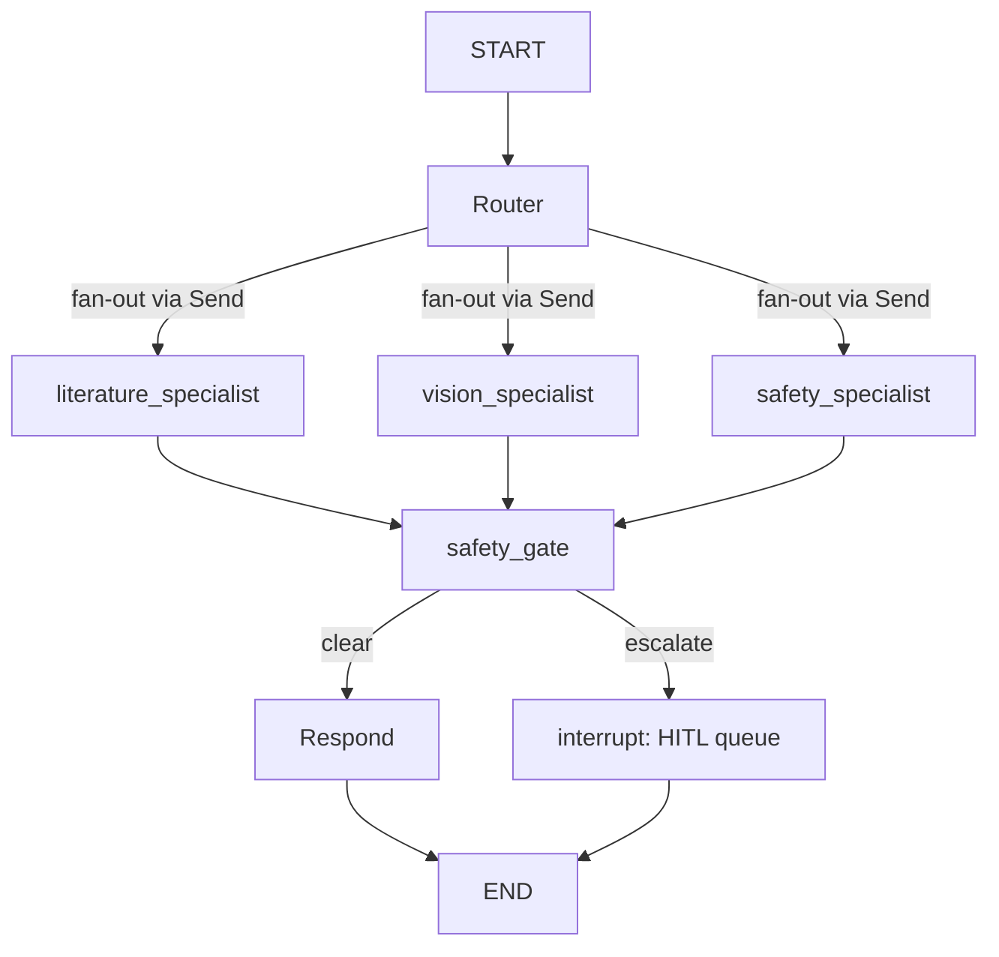

# M5 orchestration design: the Hard Safety Gate as a graph node

This is the target blueprint for M5 — not runnable today. It depends on
`llm_router`, `keyword_net`, and the guardrail check functions that M1/M3
implement, and `langgraph` is currently an optional extra
(`pip install labmate[orchestration]`) rather than a core dependency until
this milestone lands. Kept here so the design is legible before the code
catches up, per MILESTONES.md.

## Graph shape



The gate sits **after every specialist, not just the safety specialist** —
this is the one non-negotiable structural property of the whole system
(see docs/architecture.md).

## Core code

```python
import operator
from typing import Annotated, Literal, TypedDict

from langgraph.checkpoint.postgres import PostgresSaver
from langgraph.graph import END, START, StateGraph
from langgraph.types import Command, Send, interrupt


class LabMateState(TypedDict):
    user_input: str
    image_path: str | None
    routes: list[str]
    drafts: Annotated[dict[str, dict], operator.or_]  # specialist name -> draft
    gate_verdict: dict | None
    final_response: str | None


def router_node(state: LabMateState) -> dict:
    """LLM router (Haiku 4.5) union'd with the M0 deterministic keyword net.

    The keyword net from src/labmate/orchestrator.py is NOT retired here —
    it runs alongside the LLM router and can force a route the model
    missed. See docs/architecture.md, gap #3.
    """
    from labmate import orchestrator as keyword_net
    from labmate.mcp_server import llm_router  # M5: the Haiku classification call

    llm_routes = set(llm_router.classify(state["user_input"]))
    forced = {keyword_net.route(state["user_input"], has_image=bool(state.get("image_path")))}
    return {"routes": sorted(llm_routes | forced)}


def fan_out_to_specialists(state: LabMateState) -> list[Send]:
    node_by_route = {
        "literature": "literature_specialist",
        "vision": "vision_specialist",
        "safety": "safety_specialist",
    }
    return [Send(node_by_route[r], state) for r in state["routes"]]


def safety_gate_node(state: LabMateState) -> Command[Literal["respond", "escalate"]]:
    """The Hard Safety Gate. Two independent checks; either failing escalates.

    1. Deterministic hazard/entity match -- cannot be reasoned around by a
       model, catches the cases an LLM evaluator might rationalize past.
    2. LLM groundedness check -- a SEPARATE call from whichever specialist
       produced the draft (a specialist never grades its own homework).
       See docs/system_prompts.md for its exact instructions.

    "No matching source found" is treated as unresolved -> escalate, never
    as "not flagged, therefore safe" (docs/architecture.md, gap #4).
    """
    from labmate.guardrails import deterministic_hazard_check, llm_groundedness_check

    for specialist_name, draft in state["drafts"].items():
        if deterministic_hazard_check(draft) == "escalate":
            return Command(
                goto="escalate",
                update={"gate_verdict": {"verdict": "escalate", "stage": "deterministic", "specialist": specialist_name}},
            )

    verdicts = {
        name: llm_groundedness_check(state["user_input"], draft)
        for name, draft in state["drafts"].items()
    }
    if any(v["verdict"] == "escalate" for v in verdicts.values()):
        return Command(goto="escalate", update={"gate_verdict": verdicts})

    return Command(goto="respond", update={"gate_verdict": verdicts})


def escalate_node(state: LabMateState) -> dict:
    """Pauses the graph and surfaces the case to the M4 HITL review queue.
    A human resolves it out-of-band; the queue UI resumes this run with
    Command(resume={"human_response": ...}). The PDF incident report
    (M5) is generated from the resolved state, never before resolution.
    """
    decision = interrupt(
        {
            "user_input": state["user_input"],
            "drafts": state["drafts"],
            "gate_verdict": state["gate_verdict"],
        }
    )
    return {"final_response": decision["human_response"]}


def respond_node(state: LabMateState) -> dict:
    combined = "\n\n".join(draft["text"] for draft in state["drafts"].values())
    return {"final_response": combined}


def build_graph(checkpointer):
    graph = StateGraph(LabMateState)
    graph.add_node("router", router_node)
    graph.add_node("literature_specialist", literature_specialist_node)
    graph.add_node("vision_specialist", vision_specialist_node)
    graph.add_node("safety_specialist", safety_specialist_node)
    graph.add_node("safety_gate", safety_gate_node)
    graph.add_node("escalate", escalate_node)
    graph.add_node("respond", respond_node)

    graph.add_edge(START, "router")
    graph.add_conditional_edges(
        "router",
        fan_out_to_specialists,
        ["literature_specialist", "vision_specialist", "safety_specialist"],
    )
    for specialist in ("literature_specialist", "vision_specialist", "safety_specialist"):
        graph.add_edge(specialist, "safety_gate")
    graph.add_edge("respond", END)
    graph.add_edge("escalate", END)

    return graph.compile(checkpointer=checkpointer)
```

## Why `Command(goto=...)` instead of a plain conditional-edge function

The gate needs to attach its verdict to state *and* decide the next node in
one step, and needs to run two genuinely different kinds of check
(deterministic, then LLM) with an early return the moment either one fails
— that reads more clearly as an imperative function body than as a
separate routing function bolted onto a plain edge. It's the same reason
`escalate_node` calls `interrupt()` directly rather than routing to a
dead-end node: the pause needs to happen exactly at the point a human
decision becomes necessary, not one hop later.

## What's deliberately left out of this blueprint

- Retry/timeout handling on the specialist calls
- The actual `deterministic_hazard_check` / `llm_groundedness_check`
  implementations (M3)
- The PDF report generator (M5, downstream of a resolved `interrupt`)
- Auth on the HITL resume endpoint (M4's review-queue UI)

Leaving these out here isn't an oversight — they're each their own
milestone deliverable, and inlining a fake version now would hide exactly
the kind of shortcut this project is meant to prove you don't take.
